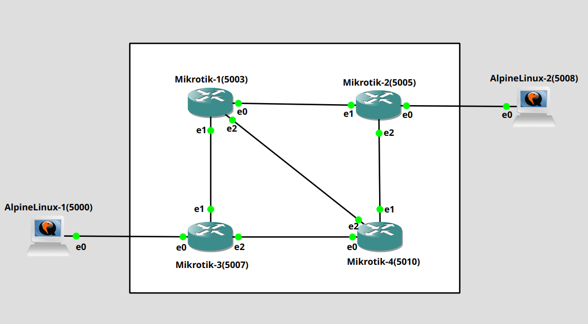
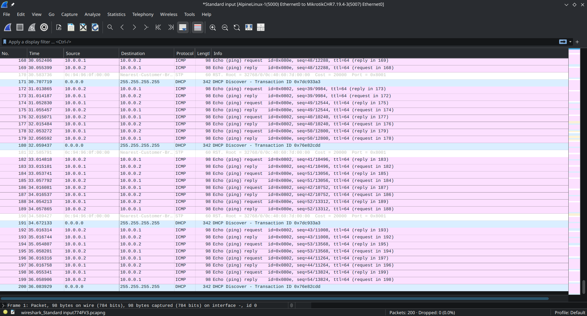
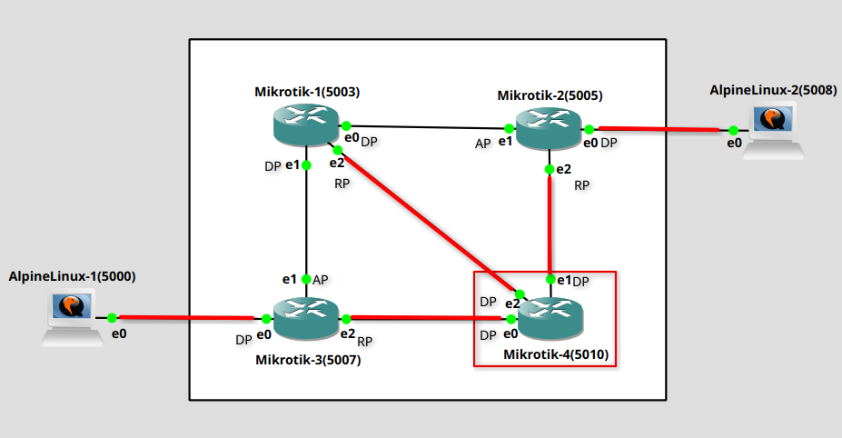
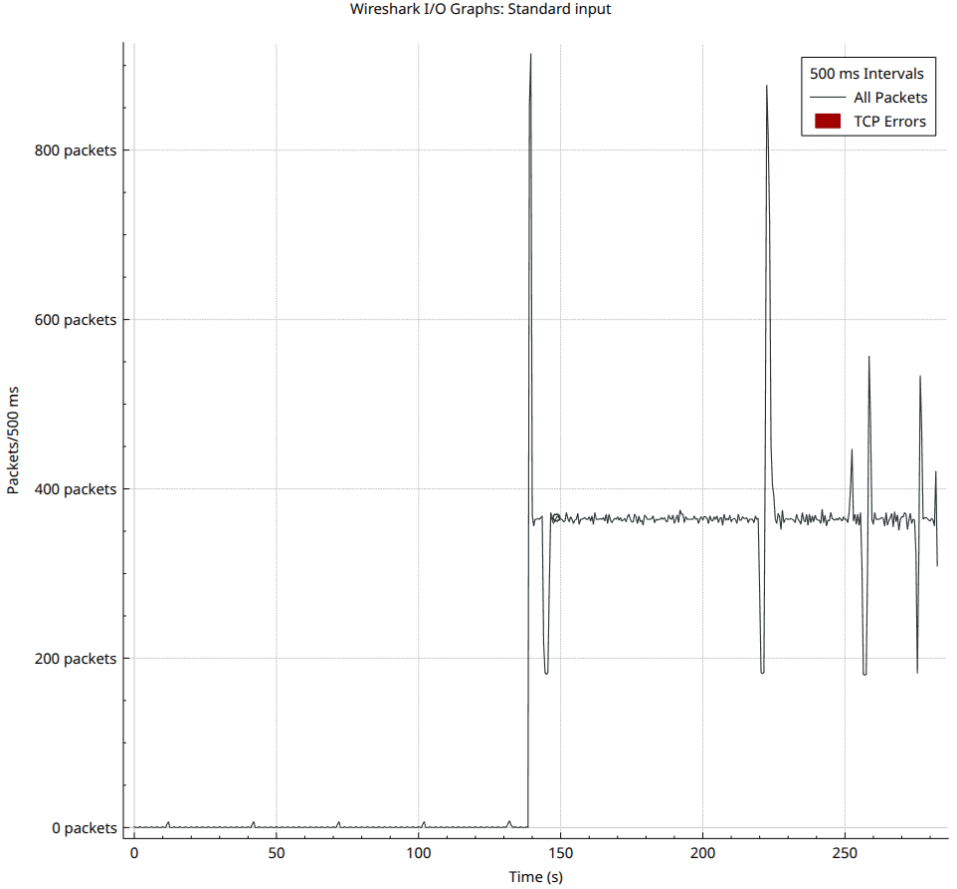
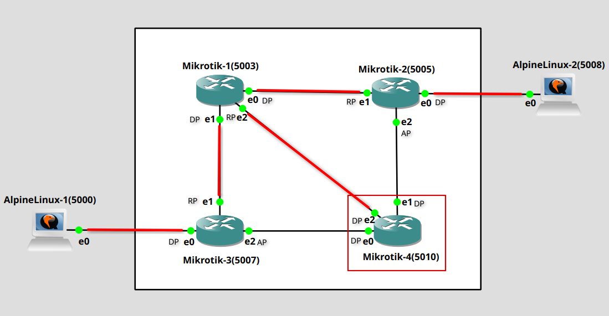
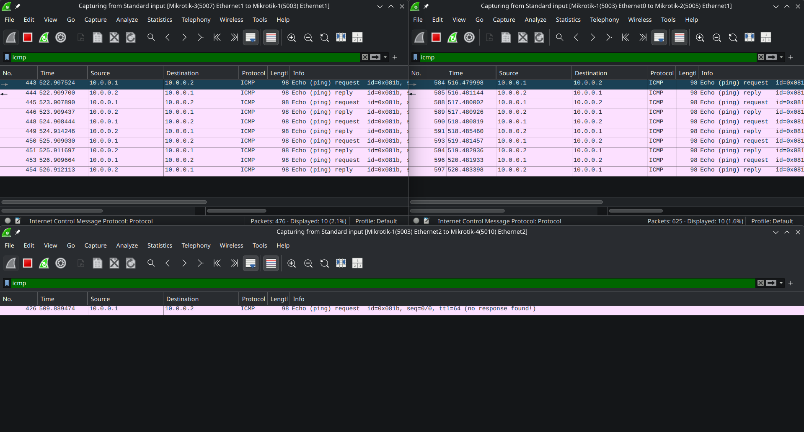
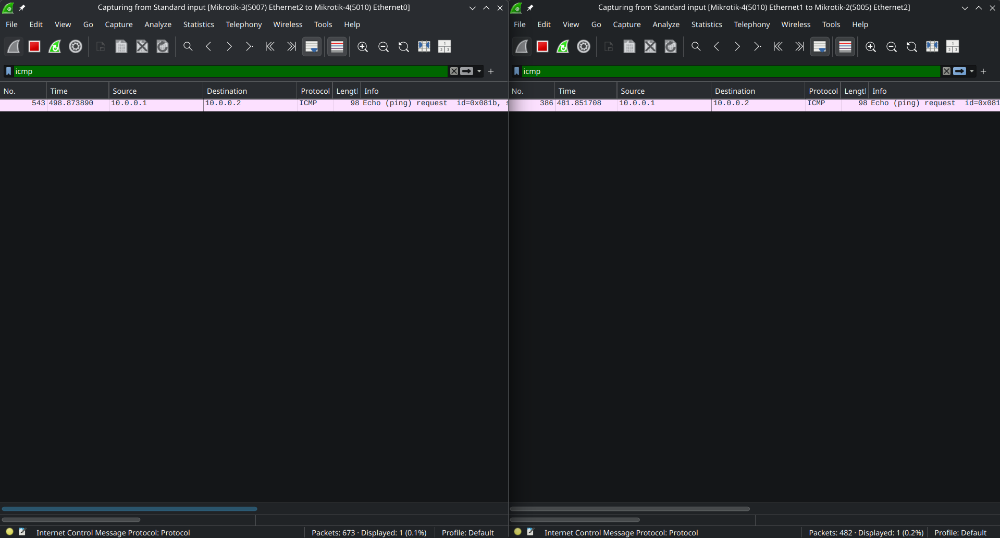
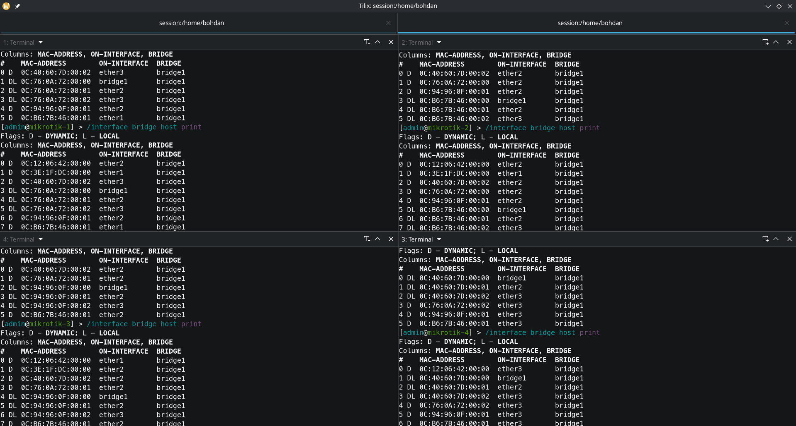

# Computer Networks: Lab 1

**Name:** Bohdan Zasymovych \
**NOS:** MikroTik \
**Topology:** B

---

## Initial configuration
 


### Configure Alpine Hosts

Static IPs were assigned on both Alpine hosts by editing `/etc/network/interfaces` to make the changes survive reboot.

**AlpineLinux-1 `/etc/network/interfaces`:**
```text
auto lo
iface lo inet loopback

auto eth0
iface eth0 inet static
  address 10.0.0.1
  netmask 255.255.255.0
```
 
**AlpineLinux-2 `/etc/network/interfaces`:**
```text
auto lo
iface lo inet loopback

auto eth0
iface eth0 inet static
  address 10.0.0.2
  netmask 255.255.255.0
```
 
### Configure MikroTik Switches

RouterOS doesn't bridge ports by default - each `etherX` stays isolated until added to a bridge. Same steps run on all four MikroTik VMs.
 
**1. Check link status** (`R` = running):
```bash
/interface print
```
```text
Flags: R - RUNNING
Columns: NAME, TYPE, ACTUAL-MTU, MAC-ADDRESS
#   NAME    TYPE      ACTUAL-MTU  MAC-ADDRESS
0 R ether1  ether           1500  0C:B6:7B:46:00:00
1 R ether2  ether           1500  0C:B6:7B:46:00:01
2 R ether3  ether           1500  0C:B6:7B:46:00:02
3   ether4  ether           1500  0C:B6:7B:46:00:03
4 R lo      loopback       65536  00:00:00:00:00:00
```
`ether1`–`ether3` are up; `ether4` isn't cabled.
 
**2. Create the bridge:**
```bash
/interface bridge add name=bridge1
```
```bash
/interface bridge print
```
```text
Flags: D - dynamic; X - disabled, R - running
 0  R name="bridge1" mtu=auto actual-mtu=1500 l2mtu=65535 arp=enabled arp-timeout=auto
      mac-address=0E:E4:BC:F8:27:4C protocol-mode=rstp fast-forward=yes igmp-snooping=no
      auto-mac=yes ageing-time=5m priority=0x8000 max-message-age=20s forward-delay=15s
      transmit-hold-count=6 vlan-filtering=no dhcp-snooping=no port-cost-mode=long mvrp=no
      max-learned-entries=auto
```
 
**3. Add each port to the bridge:**
```bash
/interface bridge port add bridge=bridge1 interface=ether1
/interface bridge port add bridge=bridge1 interface=ether2
/interface bridge port add bridge=bridge1 interface=ether3
```
 
**4. Verify the ports joined the bridge:**
```bash
/interface bridge port print
```
```text
Columns: INTERFACE, BRIDGE, HW, HORIZON, TRUSTED, FAST-LEAVE, BPDU-GUARD, EDGE, POINT-TO-POINT>
# INTERFACE  BRIDGE   HW   HORIZON  TRUSTED  FAST-LEAVE  BP  EDGE  POIN  PVID  FRAME-TYPES
0 ether1     bridge1  yes  none     no       no          no  auto  auto     1  admit-all
1 ether2     bridge1  yes  none     no       no          no  auto  auto     1  admit-all
2 ether3     bridge1  yes  none     no       no          no  auto  auto     1  admit-all
```

After repeating this on all four MikroTik VMs, `ping 10.0.0.2` on alpine-1 and `ping 10.0.0.1` on alpine-2 both worked, with request and reply packets visible in Wireshark.
 


### Exported Configuration of the Switches

**mikrotik-1:**
```text
[admin@mikrotik-1] > export
# 2026-09-25 15:18:47 by RouterOS 7.19.4
# system id = 2+FfVjAsZ5F
#
/interface bridge
add name=bridge1
/interface ethernet
set [ find default-name=ether1 ] disable-running-check=no
set [ find default-name=ether2 ] disable-running-check=no
set [ find default-name=ether3 ] disable-running-check=no
set [ find default-name=ether4 ] disable-running-check=no
/port
set 0 name=serial0
/interface bridge port
add bridge=bridge1 interface=ether1
add bridge=bridge1 interface=ether2
add bridge=bridge1 interface=ether3
/ip dhcp-client
# DHCP client can not run on slave or passthrough interface!
add interface=ether1
/system identity
set name=mikrotik-1
```

**mikrotik-2:**
```text
[admin@mikrotik-2] > export
# 2026-09-25 15:28:00 by RouterOS 7.19.4
# system id = fZUCpZwANcC
#
/interface bridge
add name=bridge1
/interface ethernet
set [ find default-name=ether1 ] disable-running-check=no
set [ find default-name=ether2 ] disable-running-check=no
set [ find default-name=ether3 ] disable-running-check=no
set [ find default-name=ether4 ] disable-running-check=no
/port
set 0 name=serial0
/interface bridge port
add bridge=bridge1 interface=ether1
add bridge=bridge1 interface=ether2
add bridge=bridge1 interface=ether3
/ip dhcp-client
# DHCP client can not run on slave or passthrough interface!
add interface=ether1
/system identity
set name=mikrotik-2
```

**mikrotik-3:**
```text
[admin@mikrotik-3] > export
# 2026-09-25 15:28:05 by RouterOS 7.19.4
# system id = fT5QtN2fq1E
#
/interface bridge
add name=bridge1
/interface ethernet
set [ find default-name=ether1 ] disable-running-check=no
set [ find default-name=ether2 ] disable-running-check=no
set [ find default-name=ether3 ] disable-running-check=no
set [ find default-name=ether4 ] disable-running-check=no
/port
set 0 name=serial0
/interface bridge port
add bridge=bridge1 interface=ether1
add bridge=bridge1 interface=ether2
add bridge=bridge1 interface=ether3
/ip dhcp-client
# DHCP client can not run on slave or passthrough interface!
add interface=ether1
/system identity
set name=mikrotik-3
```

**mikrotik-4:**
```text
[admin@mikrotik-4] > export
# 2026-09-25 15:28:08 by RouterOS 7.19.4
# system id = AoxFsPrzEUE
#
/interface bridge
add name=bridge1
/interface ethernet
set [ find default-name=ether1 ] disable-running-check=no
set [ find default-name=ether2 ] disable-running-check=no
set [ find default-name=ether3 ] disable-running-check=no
set [ find default-name=ether4 ] disable-running-check=no
/port
set 0 name=serial0
/interface bridge port
add bridge=bridge1 interface=ether1
add bridge=bridge1 interface=ether2
add bridge=bridge1 interface=ether3
/ip dhcp-client
# DHCP client can not run on slave or passthrough interface!
add interface=ether1
/system identity
set name=mikrotik-4
```

---

## Finding the built STP topology

To find the root bridge, run:

```bash
/interface bridge monitor bridge1
```

and check the `root-bridge` field - if it's `yes`, the current bridge is root.

In my case, mikrotik-4 was root:

```text
[admin@mikrotik-4] > /interface bridge monitor bridge1
                  state: enabled
    current-mac-address: 0C:40:60:7D:00:00
              bridge-id: 0x8000.0C:40:60:7D:00:00
            root-bridge: yes
         root-bridge-id: 0x8000.0C:40:60:7D:00:00
         root-path-cost: 0
              root-port: none
             port-count: 3
  designated-port-count: 3
           fast-forward: no
```

To find the role of each port:

```bash
/interface bridge port monitor [find interface=ether1]
```

The `role` field shows one of: `root-port`, `designated-port`, `alternate-port`. This was run for every connected port on every MikroTik VM.

**Port roles (initial topology):**

| Switch     | ether1            | ether2            | ether3            |
|------------|-------------------|--------------------|--------------------|
| mikrotik-1 | designated-port   | designated-port    | root-port          |
| mikrotik-2 | designated-port   | alternate-port     | root-port          |
| mikrotik-3 | designated-port   | alternate-port     | root-port          |
| mikrotik-4 | designated-port   | designated-port    | designated-port    |

The resulting initial topology is shown below:



On the diagram:
- **DP** – designated port
- **RP** – root port
- **AP** – alternate port
- GNS3's automatic port labels start numbering from 0, while the MikroTik CLI numbers the same interfaces starting from 1 (e.g. GNS3's `e0` = RouterOS's `ether1`).

The topology was additionally verified by running `ping 10.0.0.2` on alpine-1 and checking all inter-switch links with Wireshark. Traffic was seen on every link highlighted in the diagram (on the mikrotik-1 <-> mikrotik-2 link, only for the first ping, since that frame was unknown unicast).

---

## Disable STP and Create a Broadcast Storm

**Disable STP on a port:**
```bash
/interface bridge port set [find interface=ether1] edge=yes
```
> **Note:** there is no dedicated command to disable STP on just a port. This command instead marks the port as an edge port (i.e. a port connected to a host, not another switch). Since a loop is impossible on a true host-facing port, the port immediately enters forwarding mode, stops sending its own BPDUs, and ignores any it receives. Applied to an inter-switch link, this is functionally equivalent to disabling STP on that port.

**Disable STP on a switch (whole bridge):**
```bash
/interface bridge set bridge1 protocol-mode=none
```

To create a broadcast storm, I disabled STP on mikrotik-1: since it had an alternate port, disabling STP there turned that port into a forwarding port and created the loop.



This plot illustrates the number of requests per second, generated via Wireshark's **Statistics → I/O Graphs**. At second 140, STP was disabled on mikrotik-1, and the packet rate jumped from under 10/500ms to roughly 380 packets/500ms. Most of the flood consisted of broadcast DHCP, MNDP, and CDP traffic, which is sent by default - confirmed by inspecting the packets in Wireshark.

As an alternative, instead of disabling STP for the whole switch, I made port `ether2` (which had the `alternate-port` role) an edge port and reproduced the same broadcast storm.

---

## Changing the Topology

In the topology that was built automatically, the root bridge was already in the correct place - only the roles of the non-root ports needed to change. This is done by adjusting port path costs.

To read a port's currently active cost, check the `actual-path-cost` field:
```bash
/interface bridge port monitor [find interface=ether1]
```

The default path cost on every bridge was `20000`.

To reach the target topology, I needed to eliminate the links between mikrotik-3 <-> mikrotik-4 and mikrotik-2 <-> mikrotik-4. To do this, I set the path cost on `ether3` of mikrotik-2 and `ether3` of mikrotik-3 to `50000` - since `ether3` on each is their direct link to the root (mikrotik-4). This makes that direct link more expensive than reaching the root via the two-hop path through mikrotik-1 (20000 + 20000 = 40000).

```bash
/interface bridge port set [find interface=ether3] path-cost=50000
```

To verify the topology change, I checked the role of every port again:
```bash
/interface bridge port monitor [find interface=ether1]
```

**Port roles (after topology change):**

| Switch     | ether1            | ether2             | ether3             |
|------------|--------------------|---------------------|---------------------|
| mikrotik-1 | designated-port    | designated-port     | root-port           |
| mikrotik-2 | designated-port    | root-port           | alternate-port      |
| mikrotik-3 | designated-port    | root-port           | alternate-port      |
| mikrotik-4 | designated-port    | designated-port     | designated-port     |

The resulting topology is shown below:



To check the actual path traffic takes, I used Wireshark and sent `ping -c 5 10.0.0.2` from alpine-1. Results are shown below.




Full request/response traffic is visible on the mikrotik-3 <-> mikrotik-1 and mikrotik-1 <-> mikrotik-2 links. On the other links, only a single request appears - the first ping, sent as unknown unicast before the switches learned the destination MAC.

To reproduce this kind of capture in real life, one can configure port mirroring on the MikroTik switches:
```bash
/interface ethernet set ether1 mirror-source=ether2 mirror-target=ether1
```
and plug a laptop running Wireshark into the port traffic is mirrored to.

**FDB verification:** the correctness of the traffic path was additionally checked via the switches' FDBs. On mikrotik-1, -2, and -3 (all on the traffic path), entries for both Alpine hosts are present on the expected ports. On mikrotik-4, only an entry for alpine-1 is present, learned via `ether3` (the diagonal link to mikrotik-1) - this link is part of the active topology (mikrotik-1's root port), so it correctly received a copy of the initial unknown-unicast flood, even though it isn't part of the ongoing ping's forwarding path.

Picture below shows states of FDBs before and after ping on each of the MikroTik VMs



- Alpine-1 MAC: `0C:12:06:42:00:00`
- Alpine-2 MAC: `0C:3E:1F:DC:00:00`

---

## Additional Questions

1. **What is the difference between port cost and port priority?**
   Port cost is the value that gets added to the root path cost carried in the BPDU received on that port - in other words, it's how much "distance" using this specific port adds when calculating the total cost to reach the root bridge. By default this value depends on the link's speed (e.g. 20000 for the 1Gb/s link), but it can also be configured manually. Port priority, on the other hand, is only used as a tiebreaker - it comes into play when two ports offer an equal-cost path to the root, either when a switch is choosing its own root port among several equally-cheap candidates, or when two switches on the same segment are competing to be that segment's designated port. If the path costs already differ, priority is never even considered; cost alone decides the outcome.

2. **Is there sense to use Edge port in your topologies and why?**
   Yes, there is sense to use edge ports in our topologies. They should be used for the links between switches and hosts (alpine-1 <-> mikrotik-3 and alpine-2  <->  mikrotik-2). Since a loop cannot be formed using these links, it is safe to open the port for forwarding directly and skip the intermediate steps STP/RSTP normally goes through, lowering the delay on the host connection. But edge ports should not be used on any links between switches, since it can cause a broadcast storm, as shown in the lab.

3. **What in practice might require changing routes automatically chosen by the protocol?**
   * STP chooses a link only by cost (which by default depends on link speed), but it does not account for load, latency, or the real reliability of the cables and switches on that link. Using a custom metric can account for such factors.
   * Before physically removing a switch or cable, the cost of the path going through it can be increased so the topology changes smoothly instead of a sudden change on removal.
   * In big networks there may be a need to explicitly set root and paths to have a predictable layout, which is easier to document and debug if needed, rather than having a layout created almost randomly by default priorities and MAC addresses of the devices.

4. **Is there sense to turn on STP if there is only single switch with multiple ports?**
   Yes, there is sense to turn on STP. Despite the fact that a loop between multiple switches cannot be created in this case, it is possible to create a loop within a single switch by connecting two of its own ports together with a cable. Such a situation should be rare, but it is possible due to human error.